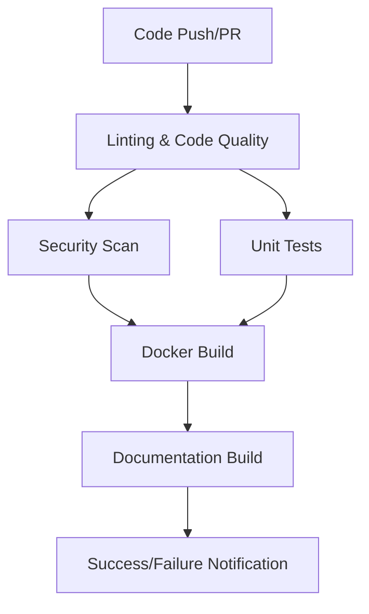
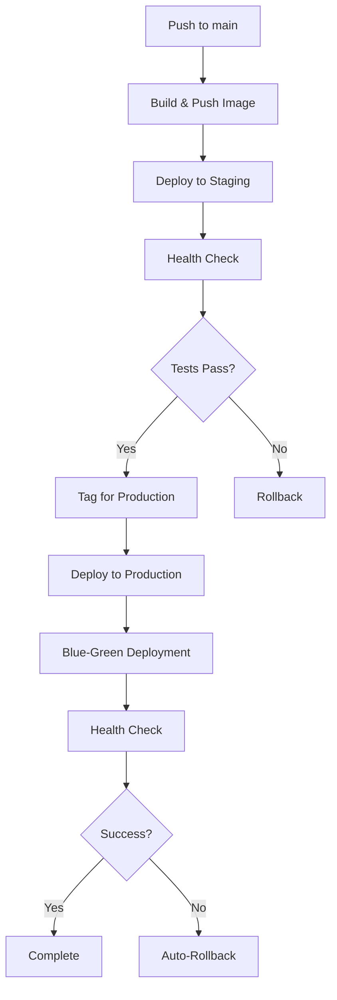
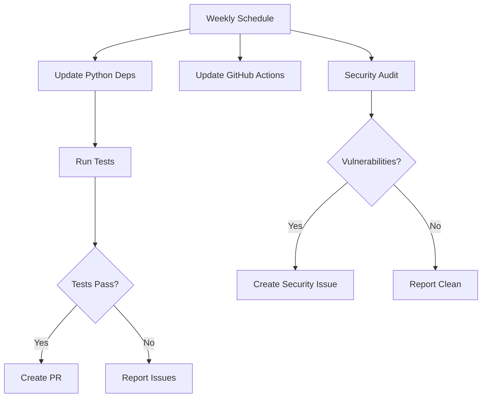
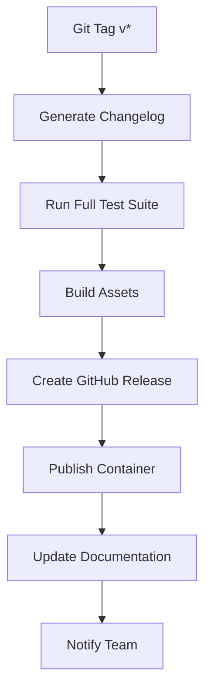

# 🚀 GitHub Repository Setup & CI/CD Guide

## 📋 Übersicht

Dieses Dokument beschreibt die vollständige GitHub-Integration für das QR Info Portal, einschließlich automatischer CI/CD-Pipelines, Deployments und Repository-Management.

## 🏗️ Repository-Struktur

```
.github/
├── workflows/
│   ├── ci.yml                    # CI/CD Pipeline (Tests, Linting, Security)
│   ├── deployment.yml            # Automated Staging/Production Deployment
│   ├── dependency-updates.yml    # Automated Dependency Management
│   └── release.yml               # Automated Release Management
├── ISSUE_TEMPLATE/
│   ├── bug_report.yml           # Structured Bug Reports
│   └── feature_request.yml      # Feature Request Templates
├── dependabot.yml               # Automated Dependency Updates
└── pull_request_template.md     # Pull Request Template
```

## 🔧 Setup-Schritte

### 1. Repository-Einrichtung

```bash
# Repository initialisieren und push
git add .
git commit -m "feat: Add comprehensive GitHub CI/CD setup"
git push origin main

# Branches erstellen
git checkout -b develop
git push origin develop
```

### 2. GitHub Repository-Settings

#### Branch Protection Rules
```
main branch:
✅ Require pull request reviews before merging (2 reviewers)
✅ Dismiss stale PR reviews when new commits are pushed
✅ Require status checks to pass before merging
✅ Require branches to be up to date before merging
✅ Include administrators
✅ Allow force pushes (disabled)
✅ Allow deletions (disabled)

develop branch:
✅ Require pull request reviews before merging (1 reviewer)
✅ Require status checks to pass before merging
```

#### Required Status Checks
```
- lint/Code Quality
- test/Run Tests (Python 3.11)
- test/Run Tests (Python 3.12)
- security/Security Scan
- build/Build Docker Image (for main branch)
```

### 3. GitHub Secrets Configuration

#### Repository Secrets
```bash
# Production Deployment
PROD_HOST=your-production-server.com
PROD_USER=deploy
PROD_SSH_KEY=<private-ssh-key-content>

# Staging Deployment
STAGING_HOST=your-staging-server.com
STAGING_USER=deploy
STAGING_SSH_KEY=<private-ssh-key-content>

# Application Configuration
SECRET_KEY=your-super-secret-production-key
ADMIN_USERNAME=your-admin-username
ADMIN_PASSWORD=your-secure-admin-password

# Notifications
SLACK_WEBHOOK=https://hooks.slack.com/services/YOUR/SLACK/WEBHOOK

# Container Registry (uses GITHUB_TOKEN automatically)
# GITHUB_TOKEN is automatically available
```

#### Environment Secrets
```
Production Environment:
- Same secrets as above, with production-specific values

Staging Environment:
- Same secrets with staging-specific values
```

### 4. Server-Vorbereitung

#### Production Server Setup
```bash
# Install Docker and Docker Compose
curl -fsSL https://get.docker.com -o get-docker.sh
sh get-docker.sh
sudo apt-get install docker-compose-plugin

# Create deployment user
sudo useradd -m -s /bin/bash deploy
sudo usermod -aG docker deploy

# Setup SSH key authentication
sudo -u deploy mkdir -p /home/deploy/.ssh
echo "YOUR_PUBLIC_KEY" | sudo -u deploy tee /home/deploy/.ssh/authorized_keys
sudo chmod 600 /home/deploy/.ssh/authorized_keys
sudo chmod 700 /home/deploy/.ssh

# Create application directories
sudo mkdir -p /opt/qr-portal/{data,logs,ssl,backups}
sudo chown -R deploy:deploy /opt/qr-portal
```

#### Staging Server Setup
```bash
# Same as production, but with staging paths
sudo mkdir -p /opt/qr-portal-staging/{data,logs,ssl,backups}
sudo chown -R deploy:deploy /opt/qr-portal-staging
```

## 🔄 Workflow-Übersicht

### 1. CI/CD Pipeline (`ci.yml`)
**Trigger:** Push zu main/develop, Pull Requests


**Features:**
- ✅ Code-Qualitätsprüfung (Black, isort, Flake8, MyPy)
- ✅ Sicherheitsscan (Safety, Bandit)
- ✅ Multi-Python-Version-Tests (3.11, 3.12)
- ✅ Docker-Image-Build und Test
- ✅ Dokumentation-Build
- ✅ Coverage-Reports

### 2. Deployment Pipeline (`deployment.yml`)
**Trigger:** Push zu main (Staging), Tags (Production)


**Features:**
- ✅ Staging-Deployment bei main-Push
- ✅ Production-Deployment bei Tag-Release
- ✅ Blue-Green-Deployment
- ✅ Automatischer Rollback bei Fehlern
- ✅ Health-Checks und Smoke-Tests
- ✅ Backup-Erstellung vor Deployment

### 3. Dependency Updates (`dependency-updates.yml`)
**Trigger:** Wöchentlich (Montags)


**Features:**
- ✅ Wöchentliche Dependency-Updates
- ✅ Automatische Tests der Updates
- ✅ Pull-Request-Erstellung
- ✅ Sicherheitsaudit mit Safety und pip-audit
- ✅ GitHub Actions Updates

### 4. Release Management (`release.yml`)
**Trigger:** Git Tags (v*), Manual Trigger


**Features:**
- ✅ Automatische Changelog-Generierung
- ✅ Vollständige Testsuite
- ✅ Docker-Image und Source-Archive
- ✅ Deployment-Skripte
- ✅ GitHub Release mit Assets
- ✅ Container Registry Publish

## 📊 Monitoring & Benachrichtigungen

### Slack-Integration
```yaml
# Erfolgreiche Deployments
✅ Production deployment successful! Version: v1.2.3

# Fehlerhafte Deployments  
❌ Production deployment failed! Rollback initiated.

# Sicherheitswarnungen
🚨 Security Alert: Dependency Vulnerabilities Found

# Release-Benachrichtigungen
🎉 New Release Published! Version: v1.2.3
```

### Metriken und Reports
- ✅ Code-Coverage-Reports (Codecov)
- ✅ Sicherheitsscan-Ergebnisse
- ✅ Performance-Metriken
- ✅ Deployment-Status

## 🔐 Sicherheit

### Branch Protection
- ✅ Pflicht für Pull Request Reviews
- ✅ Status Checks müssen bestehen
- ✅ Force Push verhindert
- ✅ Admin-Regeln gelten auch für Maintainer

### Secret Management
- ✅ Keine Secrets im Code
- ✅ Environment-spezifische Secrets
- ✅ Rotation von SSH-Keys möglich
- ✅ Audit-Log für Secret-Zugriffe

### Container Security
- ✅ Multi-Stage Docker Builds
- ✅ Non-Root User in Container
- ✅ Security-Scanning der Images
- ✅ Signierte Container Images

## 📈 Optimierungen

### Performance
- ✅ Build-Cache für Docker
- ✅ Dependency-Caching
- ✅ Parallele Job-Ausführung
- ✅ Artifact-Sharing zwischen Jobs

### Resource-Effizienz
- ✅ Conditional Job-Ausführung
- ✅ Matrix-Builds für Multi-Version-Tests
- ✅ Cleanup von temporären Ressourcen
- ✅ Optimierte Runner-Auswahl

## 🚨 Troubleshooting

### Häufige Probleme

#### 1. SSH-Verbindung zu Servern fehlschlägt
```bash
# Lösung: SSH-Key in GitHub Secrets prüfen
# Server-seitig: authorized_keys validieren
ssh-keygen -f ~/.ssh/id_rsa -y > ~/.ssh/id_rsa.pub
```

#### 2. Docker Build fehlschlägt
```bash
# Lösung: Dockerfile validieren
docker build --no-cache .
# GitHub Actions: Build-Cache löschen
```

#### 3. Tests schlagen fehl
```bash
# Lokal testen:
pip install -r requirements.txt
pytest -v
# Environment-Variablen prüfen
```

#### 4. Deployment Health Check fehlschlägt
```bash
# Server-seitig prüfen:
curl -f http://localhost/healthz
docker logs qr-portal-prod
```

### Debug-Tipelines
```yaml
# In Workflows für Debug aktivieren:
- name: Debug Information
  run: |
    echo "Environment: ${{ github.event_name }}"
    echo "Branch: ${{ github.ref }}"
    echo "Commit: ${{ github.sha }}"
    env
```

## 🎯 Best Practices

### Git Workflow
1. **Feature-Branch** vom `develop` branch erstellen
2. **Tests schreiben** vor Code-Implementierung
3. **Kleine, fokussierte Commits** mit klaren Nachrichten
4. **Pull Request** zu `develop` mit vollständiger Beschreibung
5. **Code Review** durch mindestens einen anderen Entwickler
6. **Merge** nach erfolgreichem Review und Tests
7. **Release** durch Merge von `develop` zu `main` + Tag

### Commit Messages
```
feat: Add visitor analytics dashboard
fix: Resolve CSRF token validation issue
docs: Update deployment documentation
security: Patch dependency vulnerabilities
perf: Optimize database queries
style: Improve mobile responsive design
refactor: Extract analytics service
test: Add integration tests for admin API
ci: Update GitHub Actions to v4
```

### Release Strategy
```
Version Pattern: v{major}.{minor}.{patch}
- v1.0.0: Major release, breaking changes
- v1.1.0: Minor release, new features
- v1.1.1: Patch release, bug fixes
- v1.2.0-beta.1: Pre-release versions
```

## 📚 Weiterführende Dokumentation

- [GitHub Actions Documentation](https://docs.github.com/en/actions)
- [Docker Best Practices](https://docs.docker.com/develop/best-practices/)
- [Flask Deployment Guide](https://flask.palletsprojects.com/en/3.0.x/deploying/)
- [Security Best Practices](./SECURITY.md)
- [Contributing Guidelines](./CONTRIBUTING.md)

---

## 🎉 Nächste Schritte

1. **Repository-Setup:** Secrets und Branch-Protection konfigurieren
2. **Server-Vorbereitung:** Staging- und Production-Server einrichten  
3. **Test-Deployment:** Ersten Deployment-Zyklus durchführen
4. **Team-Onboarding:** Entwicklerteam mit Workflows vertraut machen
5. **Monitoring:** Metriken und Alerts einrichten

**Das QR Info Portal ist jetzt bereit für professionelle Entwicklung und Deployment! 🚀**